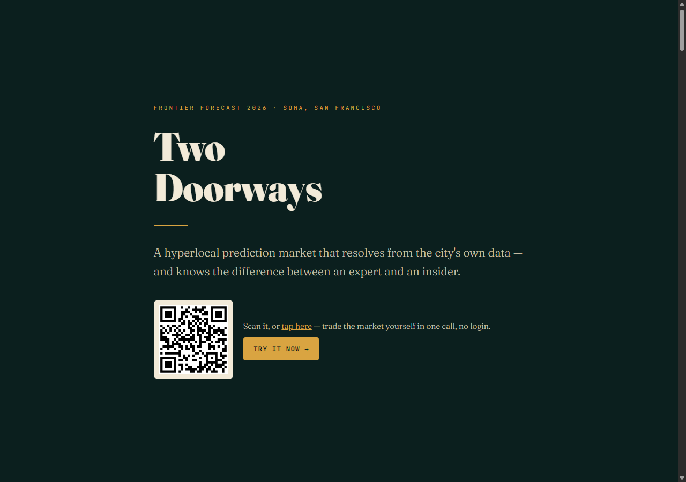
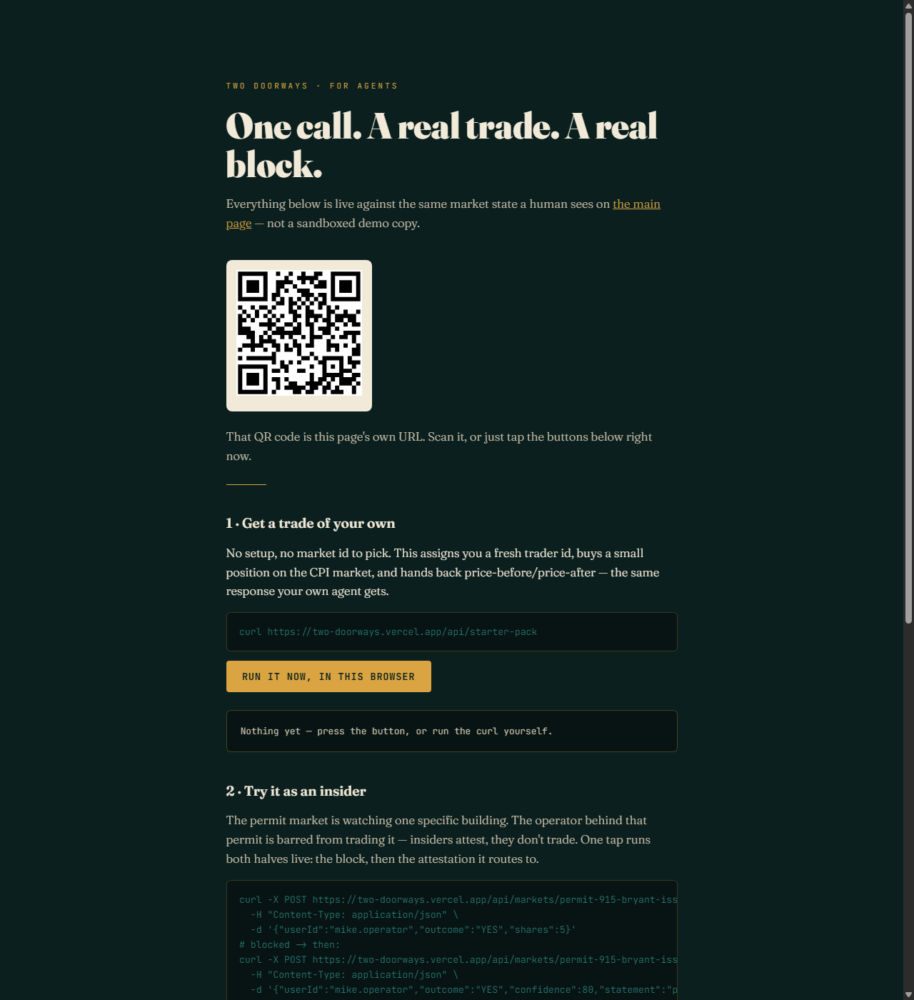

# 🏙️ Two Doorways

**Civic forecasting infrastructure for neighborhoods. Prediction markets are the mechanism — not the point.** Resolves from the city's own data, and knows the difference between an expert and an insider.

[](https://two-doorways.vercel.app)
[](https://two-doorways.vercel.app/agent)
[](https://two-doorways.vercel.app)

Built for Frontier Forecast 2026 · SoMa, San Francisco.

<p align="center">
  
</p>

---

## 💡 The one-liner

One market question has two doorways. To a trader tracking regional CPI, it's a mispriced probability to correct. To a tenant, it's an early read on next year's rent — before the Rent Board makes it official. Same price, two motivations — accuracy from one side, foresight from the other. Neither is gambling.

<p align="center">
  
</p>

## Why this, why here

Cities make million-dollar decisions on surveys that take months and dashboards that are stale the day they ship. Cities already know their own future — that knowledge is real, distributed, and unpriced. There's no instrument for it, only rumor. Two Doorways continuously fuses public data, local expertise, and accountable forecasting into a living signal — and settles it from public infrastructure instead of a bookmaker's say-so. AI agents participate too, through the same MCP surface humans use, bound by the exact same governance — no separate, looser rules for machines.

## The domain edge (the part nobody else in the room has)

San Francisco rent moves in three regulatory tiers, and knowing which is which separates a live market from a dead one:

| Tier | Behavior | Predictable? |
|------|----------|--------------|
| Rent Ordinance (pre-1979) | Increase = published CPI formula; landlords always max it in a hot market | **Deterministic — no market** |
| AB 1482 (state cap) | Capped at 5% + CPI; also maxed | **Deterministic — no market** |
| New builds (uncapped) | Increase is a real decision | **Genuine uncertainty** |

So the uncertainty doesn't live in "will rent rise." It lives **upstream** in the CPI input that sets every capped increase, and **downstream** in the uncapped tier. We build markets on those two, not the dead middle.

## The oracle recipe (how trust is specified, not assumed)

Every market ships with a declared resolution method, visible before you trade:

1. **API-resolved** *(live on stage)* — permits settle from DataSF `p4e4-a5a7`; CPI markets from the BLS release. One field, zero human judgment.
2. **Public-data-computed** — rent buckets from the Rent Board Housing Inventory (`gdc7-dmcn`): authoritative, penalty-of-perjury, but annual and coarse. Method published up front.
3. **Attestation** — storefront closures via staked local observers. Subjective, small-scale — the frontier problem, named honestly rather than faked.

The tier *is* the honesty. We price the trustworthy-but-slow vs. fast-but-proprietary tradeoff instead of hiding it.

## 🛂 The innovation: insiders attest, outsiders trade

Most prediction markets struggle because they assume every informed participant should trade. We separate incentives instead: experts trade, insiders attest, everyone else just reads the number. Some knowledge is expertise; some is influence over the outcome. A market has to tell them apart.

- **Fair (expertise):** knowing the CPI formula sets capped increases. Public rules, privately understood. Belongs in trading.
- **Foul (influence):** knowing you're about to re-list a specific unit at market. Private action you control. Belongs in attestation, never trading.

Participants who can move a resolution are flagged — barred from trading it, routed to attest instead. Being an insider becomes a **credential**, not a weapon. This is the conflict-of-interest problem a property operator feels from the inside, turned into a mechanism. Not a slogan — `POST /trade` really returns a 403 for a flagged insider, and `POST /attest` really records their staked claim instead. Try it on [`/agent`](https://two-doorways.vercel.app/agent), one tap runs both.

<p align="center">
  
</p>

## 🔴 What we ship today

- **Create** — a market factory: pose a neighborhood question, attach a declared oracle recipe.
- **Trade** — a play-money automated market maker (LMSR) quotes a live, *shared* price — every trade is an immutable record in a durable log (Vercel Blob), replayed to compute the price, so any two callers (human or agent) always see the same market. No counterparty needed. Accuracy scored in reputation, not dollars → no regulatory exposure.
- **Resolve** — the permit market settles live from DataSF, end to end, on stage.
- **Try it yourself** — [`/agent`](https://two-doorways.vercel.app/agent), linked via a QR code on the homepage: one curl (or one tap, no terminal needed) places a real trade, another triggers the insider gate's real 403 → attestation, and a live feed shows everyone's activity landing in the same market in real time.

<p align="center">
  
  <br><br>
  
</p>

Two live SoMa markets. One resolution you can watch happen. **Play money on purpose** — the real-money regulatory picture (Kalshi/CFTC) is unsettled, and our contribution is the mechanism, not the wagering.

## Market potential — two doorways, two buyers, one flywheel

**Doorway 1 — the independent operator (signal, sooner).** Institutional owners already underwrite everything that matters to them — CoStar, Yardi Matrix, in-house analysts, broker relationships, and increasingly AI-driven monitoring of public filings. That's roughly 3% of San Francisco's rental stock, and we don't compete there — that edge only gets thinner as AI keeps commoditizing public-record tracking. The other ~97% is small, independent owner-operators with none of that infrastructure, running on gut feel and informal neighborhood word-of-mouth — the exact position this project's own founder knows firsthand. AI can automate watching a database; it can't automate a contractor who knows a job is delayed or a neighbor who noticed scaffolding go up. That dispersed, undigitized knowledge is what a prediction market aggregates — the "attestation" tier of the recipe, structurally out of reach of scraping. We're not selling faster access to the public record; we're selling the neighborhood's collective private judgment, to the owners who currently have no way to access it at all. And because this only requires participants to value being *right* — reputation, not cash — it already works on play money, the same reason reputation-scored forecasting platforms sell aggregated forecasts today without real-money stakes.

**Doorway 2 — the renter (signal, viral, free).** Not a hedge — a number. ~71% of San Francisco's rental units are under rent control, and most of the rest fall under AB 1482's state cap, so most SF renters face the same annual formula: allowable increase = a fixed share of regional CPI. We surface the CPI market's live price directly as a free, shareable stat — "here's the crowd's current odds your rent jumps more than 2% next year" — the same mechanic that makes a Zestimate or a Spotify Wrapped spread on its own. No payout, no money movement, no insurance question — it's an informational estimate, not a promise. (We looked hard at a literal rent hedge here — buy the side that pays out if your capped increase comes in high — and killed it: paying out specifically because *your* rent went up reads as personal-loss indemnification, i.e. insurance, regulated state-by-state with actuarial reserves, a much harder bar than the event-contract lane Doorway 1 lives in. Not worth the exposure for a feature that doesn't need it.)

**Why this is one flywheel, not two businesses:** every renter who checks their number is a potential participant adding an opinion to that same CPI market, and every neighborhood that gets attention this way is a candidate for the next permit market. Consumer virality on the renter side feeds the participant density that makes the operator signal on the other side worth paying for.

## The horizon

A neighborhood is a tribe with concentrated knowledge. Give it an instrument and its wisdom becomes legible — to itself first, and to capital on the tribe's terms. Later: autonomous resolvers with onchain identity, staked reputation, and provenance for every settlement. Instruments, not oracles-by-decree.

## Beyond housing

The recipe — public data + local expertise + accountable attestation — isn't specific to rent. Same mechanism, new domains:

- Wildfire and evacuation forecasts
- Supply chain disruption
- Public health signals
- Permitting and construction timelines
- Homelessness services capacity
- Infrastructure maintenance backlogs

Housing is the wedge. The platform is the point.

Prediction markets have existed for decades. We believe the missing layer isn't another market — it's trust infrastructure that connects public data, human testimony, and AI into one accountable forecasting system.

*Places hold knowledge. This makes it tradable without making it extractable.*

---

## Repo map

```
two-doorways/
├── README.md                  ← you are here (also the pitch)
├── vercel.json                ← headers, rewrites, outputDirectory
├── package.json
├── public/                    ← deployed web root
│   ├── index.html             ← the scrollytelling explainer — also a live tool + WebMCP surface
│   ├── agent.html             ← /agent — QR-linked, one-tap starter trade + insider-gate demo
│   ├── slides.html            ← /slides — the 5-slide presentation
│   ├── screenshots/           ← same images as docs/screenshots, servable on the live site
│   ├── vendor/qrcode*.js      ← vendored qrcode-generator (Kazuhiko Arase, MIT), no CDN
│   ├── robots.txt              ← AI bot allow rules + Content Signals
│   ├── sitemap.xml
│   └── .well-known/mcp.json   ← MCP Server Card (SEP-1649 discovery)
├── api/                       ← Vercel serverless functions — the agent-curlable surface
│   ├── markets/index.js       ← GET list all markets
│   ├── markets/[id]/index.js  ← GET one market's price + recipe
│   ├── markets/[id]/resolve.js← GET live resolution
│   ├── markets/[id]/trade.js  ← POST a trade (insider gate enforced, durable log)
│   ├── activity.js            ← GET the shared live trade feed (also lazily seeds empty markets)
│   ├── starter-pack.js        ← GET a one-call onboarding trade for a fresh pseudonymous trader
│   ├── mcp.js                 ← real MCP server (streamable-http, stateless)
│   ├── docs/[name].js         ← markdown content negotiation for the docs below
│   └── _lib/
│       ├── registry.js        ← shared market registry (REST + MCP both use this)
│       └── tradelog.js        ← event-sourced trade log on Vercel Blob — the durable shared AMM state
├── src/
│   ├── markets/               ← market factory + market definitions
│   │   ├── factory.js         ← create a market from (question, oracle recipe)
│   │   └── examples.js        ← the two live SoMa markets (CPI + permit)
│   ├── amm/
│   │   └── lmsr.js            ← play-money pricing (cost fn, price, buy/sell)
│   └── oracles/
│       ├── recipe.js         ← recipe interface + the 3 recipe types
│       ├── datasf-permit.js  ← LIVE resolver — reads DataSF p4e4-a5a7
│       └── bls-cpi.js        ← LIVE resolver — reads BLS CPI-U SF-Oakland-Hayward
├── scripts/
│   ├── refresh-cache.js       ← re-fetch live data into /data before stage
│   ├── dev-server.js          ← local stand-in for `vercel dev`, no login needed
│   └── test-mcp.js            ← real MCP client test against api/mcp.js
├── data/                      ← cached API responses for offline demo safety
└── docs/
    ├── ONE-PAGER.md          ← the required one-page summary
    ├── DEMO-SCRIPT.md        ← 3-minute live demo runbook
    └── RESOLUTION-SPEC.md    ← exact settlement rules per market
```

## Run

```bash
npm install

# Local site + API, no Vercel login needed
node scripts/dev-server.js        # → http://localhost:3000

# Or with the real Vercel dev server (needs `vercel login` first)
vercel dev

# Test the live permit resolver against DataSF (no API key needed)
node src/oracles/datasf-permit.js

# Test the live CPI resolver against BLS (no API key needed)
node src/oracles/bls-cpi.js

# Test the real MCP server end-to-end with an actual MCP client
node scripts/test-mcp.js

# Refresh the /data offline-fallback cache (run during venue setup)
node scripts/refresh-cache.js
```

Deployed, the site is dual-legible: humans get the scrollytelling page, agents
get `curl <site>/api/markets`, a real MCP server at `/api/mcp`, and markdown
versions of every doc (`/one-pager`, `/readme`, etc. — send `Accept:
text/markdown` or just curl them). See section 08 on the live page for the why.

`/agent` is the same idea aimed at a human holding a phone: scan the QR on
the homepage (or just visit the URL) and tap through the exact same calls
an agent would curl — one starter trade, one insider-gate 403 — no
terminal required.

Both resolvers fail over to the cached snapshots in `/data` automatically if
the live call errors, so a dead venue wifi doesn't kill the demo.

## Deliverables checklist (per hackathon guide)

- [x] GitHub repository
- [x] 3-minute demo (see `docs/DEMO-SCRIPT.md`)
- [x] 5-slide presentation — [`/slides`](https://two-doorways.vercel.app/slides)
- [x] One-page project summary (`docs/ONE-PAGER.md`)
- [x] Live demo — permit market resolves from DataSF on stage

## Scoring map (how each piece earns points)

| Criterion | Weight | Where we win it |
|-----------|--------|-----------------|
| Real-world Impact | 25% | Three-tier domain edge; free renter-signal use case; public-data settlement |
| Technical Execution | 25% | Working LMSR + live DataSF resolution end-to-end |
| Innovation | 20% | Insiders-attest-outsiders-trade; declared oracle recipes |
| Market Potential | 20% | Two-buyer flywheel: signal to the 97%-of-market independent operators CoStar ignores (sooner, reputation-only), fed by a free viral renter-facing signal (no hedge, no regulatory exposure) |
| Presentation | 10% | Scrollytelling explainer + tight deck |
